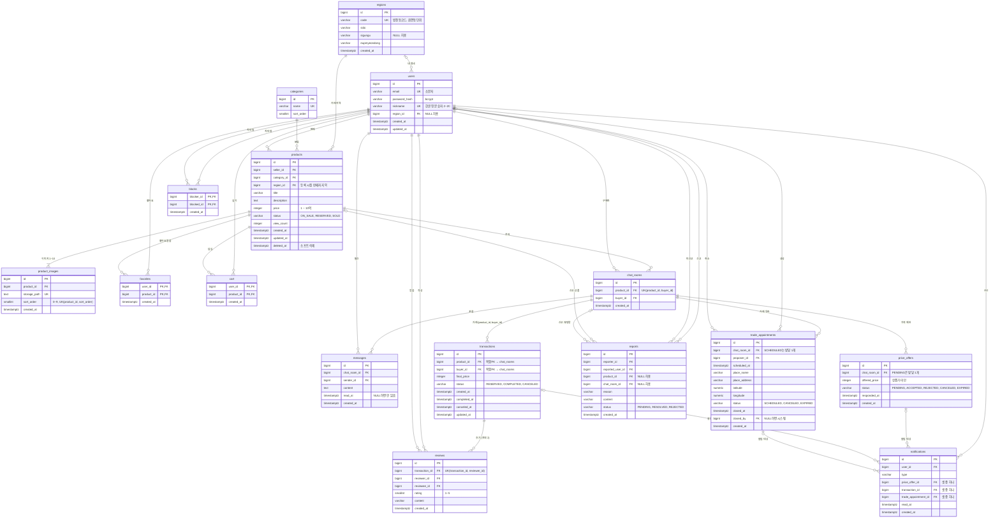

# REOWN Database 설계

> **상태: 설계 확정 v1.1 (`db/migrations/001_initial_schema.sql` Supabase 적용 완료 · seed 미적용)**
> 최종 수정일: 2026-10-04
> 대상: Supabase PostgreSQL 15 이상
> 서비스 정책 D1~D28은 팀 결정으로 확정되었다 (2장).
> 17장 "정책 해석 및 확인 필요 사항"은 팀 확인으로 확정되었고 `001_initial_schema.sql`에 반영되었다.
> DB 작업 파일(마이그레이션, seed, ERD)은 `db/` 폴더에서 관리한다 (`db/README.md`).

---

## 목차

1. 설계 원칙
2. 확정 정책 (D1~D28)
3. 최종 테이블 목록
4. 공통 규칙과 DB 접속 구조
5. 테이블 상세 설계
6. 테이블 관계
7. ON DELETE 정책
8. 인덱스 설계
9. 데이터 소유권 / 권한 설계
10. 기능별 서비스 정책 상세
11. 거래 흐름, 상태 전이, 자동 정리
12. 알림 구조 (DB vs Socket.IO)
13. 매너온도 설계
14. 좋아요 / 장바구니 정의
15. 무결성 및 보안 검토
16. Mermaid ERD
17. 정책 해석 및 확인 필요 사항
18. CLAUDE.md / README.md 정합성 검토
19. 변경 이력

---

## 1. 설계 원칙

| 원칙 | 내용 |
|---|---|
| 판매자 정보는 한 곳에만 | 판매자는 `products.seller_id`에만 저장한다. 채팅방·거래·약속은 상품을 통해 판매자를 얻는다. |
| 거래 단위는 (상품, 구매자) | `chat_rooms`와 `transactions`는 모두 `(product_id, buyer_id)` 쌍을 기준으로 연결된다. |
| 이력 데이터는 물리 삭제하지 않음 | 상품은 소프트 삭제(`deleted_at`)한다. 채팅·제안·약속·거래·후기·신고는 삭제하지 않는다. |
| 계산 가능한 값은 저장하지 않음 | 좋아요 수, 대표 이미지, 평균 평점, 마지막 메시지, 매너온도는 쿼리로 계산한다. |
| 의도된 중복은 명시 | 검색 필터를 위해 `products.status`, 조회 성능을 위해 `reviews.reviewee_id`를 저장한다. 정합성 규칙을 함께 정의한다. |
| 무결성은 가능한 한 DB에서 | 중복·동시 요청은 UNIQUE / 부분 UNIQUE / CHECK / 복합 FK로 막는다. DB로 표현할 수 없는 규칙만 백엔드에서 검증한다. |
| DB는 백엔드만 접근 | 프론트엔드는 DB에 직접 접근하지 않는다(CLAUDE.md 7장). Supabase의 공개 API 경로는 RLS로 전부 차단한다. |

---

## 2. 확정 정책 (D1~D28)

정책 결정 근거와 검토한 대안은 팀 논의 기록을 따른다. 아래는 확정된 결과이며, 각 정책을 DB와 백엔드 규칙으로 옮긴 내용은 10장과 11장에 정리되어 있다.

### 2.1 구조 정책

| # | 정책 | 확정 내용 | 반영 위치 |
|---|---|---|---|
| D1 | PK 타입 | `bigint` 자동 증가 (`GENERATED ALWAYS AS IDENTITY`) | 전체 테이블 |
| D2 | Refresh Token | 사용하지 않음. Access Token만 사용하고 로그아웃은 클라이언트에서 토큰을 삭제 | `refresh_tokens` 테이블 없음 |
| D3 | 매너온도 | 후기 기반 계산. 저장하지 않음 | 13장 |
| D4 | 관리자 기능 | 만들지 않음. 신고 처리는 Supabase 대시보드에서 관리 | `reports`, `users.role` 없음 |
| D5 | 좋아요 / 장바구니 | 둘 다 유지 | `favorites`, `cart`, 14장 |
| D6 | 백엔드 DB 접속 | `pg` + `DATABASE_URL`로 Supabase PostgreSQL에 직접 연결 | 4.2 |
| D7 | 지역 데이터 | 전국 법정동 데이터를 미리 입력 | `regions` |
| D8 | 거래완료 구매자 | 구매자 지정 필수 | `transactions` 복합 FK |

### 2.2 서비스 정책

| # | 정책 | 확정 내용 |
|---|---|---|
| D9 | 거래완료 되돌리기 | 불가 |
| D10 | 예약중 상품 삭제 | 불가. 예약 취소 후 삭제 |
| D11 | 자동 정리 | 거래완료 / 상품 삭제 / 예약 취소 / 차단 시 관련 대기 제안과 약속을 자동 정리 |
| D12 | 채팅 알림 | `notifications`에 저장하지 않음. Socket.IO + `messages.read_at` 사용 |
| D13 | 거래 상태 알림 | 구매자에게만 전달 |
| D14 | 거래 약속 | 즉시 확정. 변경 시 기존 약속을 CANCELED 처리하고 새 약속 생성. 지난 약속은 수정/취소 불가 |
| D15 | 차단 | 차단한 사용자의 상품은 내 검색/목록에서 숨김. 진행 중인 제안/약속/예약은 자동 정리. 완료된 거래와 후기는 유지 |
| D16 | 신고 | `reports.chat_room_id`를 선택 FK로 추가. 자동 제재 없음 |
| D17 | 제한값 | 상품 가격 1원 이상, 상품 이미지 1~10장, 기존 글자 수 제한 유지, 닉네임은 한글/영문/숫자 |
| D18 | 장바구니 테이블명 | `cart` 유지 |
| D19 | 회원 탈퇴 | 현재 프로젝트 범위에서 제외 |
| D20 | 상품 지역 | 상품 등록 시 사용자의 현재 설정 지역을 자동 사용 |
| D21 | 상품 상태 / 수정 | 상태는 거래 API로만 변경. 수정은 판매중일 때만. 예약된 구매자 외 다른 사용자에게 바로 거래완료 불가 |
| D22 | 가격 제안 | 판매중 상품에만. 상품 가격 미만만. 채팅방당 하루 최대 3회. 다른 구매자와 거래완료되면 수락된 제안도 EXPIRED |
| D23 | 채팅 | 판매중/예약중 상품에만 새 채팅. 거래완료 상품은 기존 채팅만. 삭제된 상품은 기존 채팅 읽기만. 메시지는 서버에서 속도 제한 |
| D24 | 후기 | 거래완료 후 7일 이내 작성. 수정/삭제 불가. 즉시 공개 |
| D25 | 조회수 | 본인 조회 제외, 짧은 시간 동안 중복 증가 방지 |
| D26 | 자기 상품 관심 등록 | 자기 상품에는 좋아요/장바구니 추가 불가 |
| D27 | 알림 보관 | 90일 보관 후 정리 |
| D28 | 닉네임 변경 | 제한 없음 |

---

## 3. 최종 테이블 목록

총 **16개**. CLAUDE.md 6장의 예상 테이블 목록과 동일하다.

| # | 테이블 | 영역 | 역할 |
|---|---|---|---|
| 1 | `users` | 회원 | 계정, 비밀번호 해시, 닉네임, 내 동네 |
| 2 | `regions` | 기준 | 지역(법정동, 읍·면·동 단위) 기준 데이터 |
| 3 | `categories` | 기준 | 상품 카테고리 기준 데이터 |
| 4 | `products` | 상품 | 상품 본체, 판매 상태, 조회수 |
| 5 | `product_images` | 상품 | 상품 이미지 경로와 순서 |
| 6 | `favorites` | 관심 | 좋아요 (공개 반응) |
| 7 | `cart` | 관심 | 장바구니 (비공개 관심 상품 목록) |
| 8 | `chat_rooms` | 거래 | 상품 × 구매자 1:1 채팅방 |
| 9 | `messages` | 거래 | 채팅 메시지 |
| 10 | `price_offers` | 거래 | 가격 제안과 결과 |
| 11 | `trade_appointments` | 거래 | 거래 약속 (변경 시 새 행, 이력 보존) |
| 12 | `transactions` | 거래 | 예약·거래완료·예약 취소 이력 |
| 13 | `reviews` | 신뢰 | 거래 후기와 평점 |
| 14 | `reports` | 신뢰 | 신고 |
| 15 | `blocks` | 신뢰 | 차단 |
| 16 | `notifications` | 알림 | 가격 제안·거래·약속 알림 |

**만들지 않는 테이블과 이유**

| 테이블 | 이유 |
|---|---|
| `refresh_tokens` | D2. Refresh Token을 사용하지 않는다. |
| `chat_participants` | 1:1 채팅이므로 `chat_rooms.buyer_id`와 `products.seller_id`로 참여자가 결정된다. |
| `message_reads` | 1:1 채팅이므로 `messages.read_at` 하나로 읽음 처리가 가능하다. |
| 매너온도 / 통계 테이블 | D3. 후기에서 계산한다. |
| 관리자 / 권한 테이블 | D4. 관리자 기능이 없다. |
| `product_views` | D25. 조회수 중복 방지는 서버 메모리로 처리한다. |

---

## 4. 공통 규칙과 DB 접속 구조

### 4.1 공통 규칙

| 항목 | 규칙 |
|---|---|
| PK | `bigint GENERATED ALWAYS AS IDENTITY` (문서에서는 `bigint (identity)`로 표기) — D1 |
| 시간 | 모두 `timestamptz`. 저장은 UTC, 화면 표시는 KST |
| `created_at` | `NOT NULL DEFAULT now()` |
| `updated_at` | `NOT NULL DEFAULT now()`. 공통 트리거 함수 `set_updated_at()`으로 갱신한다. 대상: `users`, `products`, `transactions`<br>· `users`, `transactions`: 모든 UPDATE에서 갱신<br>· `products`: **실제 상품 정보 컬럼의 값이 바뀔 때만** 갱신 (5.4 참고) |
| 상태값 | PostgreSQL ENUM 대신 `varchar` + `CHECK (status IN (...))` |
| 문자열 | 길이 제한이 의미 있는 곳은 `varchar(n)`, 긴 본문은 `text` + 길이 CHECK |
| 금액 | `integer` (원 단위) |
| 소프트 삭제 | `products.deleted_at`. 모든 공개 조회는 `deleted_at IS NULL` 조건을 포함한다. |
| 네이밍 | snake_case. 제약 이름은 `pk_`, `fk_`, `uq_`, `chk_`, `idx_` 접두사 |
| 기간 기준 | "하루", "7일", "90일"은 `now()` 기준 경과 시간(각각 24시간, 7×24시간, 90×24시간)으로 계산한다. (17장 #2) |

**상태 코드 ↔ 화면 표시**

| 테이블.컬럼 | 코드 | 화면 |
|---|---|---|
| products.status | `ON_SALE` / `RESERVED` / `SOLD` | 판매중 / 예약중 / 거래완료 |
| price_offers.status | `PENDING` / `ACCEPTED` / `REJECTED` / `CANCELED` / `EXPIRED` | 대기 / 수락 / 거절 / 제안 취소 / 자동 종료 |
| trade_appointments.status | `SCHEDULED` / `CANCELED` / `EXPIRED` | 약속 / 약속 취소(변경 포함) / 지난 약속 종료 |
| transactions.status | `RESERVED` / `COMPLETED` / `CANCELED` | 예약 / 거래완료 / 예약 취소 |
| reports.status | `PENDING` / `RESOLVED` / `REJECTED` | 접수 / 처리 완료 / 반려 |

### 4.2 DB 접속 구조 (D6, D4)

```text
Frontend ──REST / Socket.IO──▶ Backend (Express)
                                 ├─ pg (DATABASE_URL) ──▶ Supabase PostgreSQL   ← 모든 데이터 읽기/쓰기, 트랜잭션
                                 └─ supabase-js (service role) ──▶ Supabase Storage   ← 이미지 업로드/삭제만
DB 관리자 ──Supabase 대시보드──▶ reports.status 처리 (D4)
```

| 항목 | 규칙 |
|---|---|
| DB 연결 | `pg`(node-postgres) + `DATABASE_URL`. 여러 SQL을 `BEGIN … COMMIT`으로 묶는 작업(예약, 거래완료, 차단 등)이 많기 때문이다. |
| 연결 주소 | Supabase **Session pooler** 주소(`aws-0-ap-northeast-2.pooler.supabase.com:5432`, user `postgres.<project-ref>`)를 사용한다. 직접 연결 주소(`db.<project-ref>.supabase.co`)는 IPv6 전용임을 확인했고, Session pooler로 연결이 성공했다 (2026-10-04). |
| 쿼리 | 모든 값은 `$1, $2 …` 파라미터로 전달한다. |
| Storage | 이미지 파일만 supabase-js(service role 키)로 백엔드에서 처리한다. |
| RLS | 모든 테이블에 RLS를 켜고 정책은 만들지 않는다(전부 거부). anon/authenticated 키로는 어떤 데이터도 읽거나 쓸 수 없다. 백엔드 연결 계정(테이블 소유자)은 RLS의 영향을 받지 않는다. `FORCE ROW LEVEL SECURITY`는 쓰지 않는다. |
| Data API | 사용하지 않으므로 Supabase 설정에서 Data API(PostgREST) 노출을 끄는 것도 검토한다(RLS와 이중 방어). |
| 환경변수 | `DATABASE_URL`, `SUPABASE_URL`, `SUPABASE_SERVICE_ROLE_KEY`는 백엔드 `.env`에만 둔다. 프론트엔드에는 어떤 Supabase 키도 넣지 않는다. |

### 4.3 DB 관리 권한

| 항목 | 규칙 |
|---|---|
| Supabase 프로젝트 관리 | DB 관리자 1명이 단독으로 관리한다. 팀원에게 Supabase 관리자(대시보드) 권한을 공유하지 않는다. |
| 스키마 변경 | DB 관리자가 검토·승인한 경우에만 새 migration 파일로 반영한다. 절차는 `db/README.md` "DB 변경 요청 절차" |
| 기준 파일 | migration `db/migrations/`, seed `db/seeds/`, ERD `db/erd/`. 팀원은 이 파일과 이 문서를 기준으로 개발한다. |
| 팀원 DB 조회 | DBeaver로 조회만 한다. 연결 방법은 `docs/DB_CONNECTION.md` (비밀번호·전체 `DATABASE_URL`은 기록하지 않음) |

---

## 5. 테이블 상세 설계

표기
- **NULL**: `NN` = NOT NULL, `NULL` = NULL 허용
- **키**: `PK`, `FK → 테이블(컬럼)`
- 테이블 단위 제약(복합 UNIQUE, 다중 컬럼 CHECK 등)은 각 표 아래에 적는다.
- **백엔드 규칙**은 DB 제약으로 표현할 수 없어서 백엔드가 검증하는 규칙이다.

### 5.1 users

- **역할**: 회원 계정. 로그인 ID(email), bcrypt 비밀번호 해시, 공개 닉네임, 내 동네를 저장한다.

| 컬럼 | 타입 | NULL | DEFAULT | 키 | UNIQUE | CHECK | 설명 |
|---|---|---|---|---|---|---|---|
| id | bigint (identity) | NN | 자동 | PK | | | |
| email | varchar(255) | NN | | | UNIQUE | `email = lower(email)` | 로그인 ID. 백엔드에서 trim + 소문자로 정규화해 저장. **본인 외 비공개** |
| password_hash | varchar(100) | NN | | | | | bcrypt 해시. **어떤 API 응답에도 포함 금지** |
| nickname | varchar(20) | NN | | | UNIQUE | `nickname ~ '^[가-힣a-zA-Z0-9]{2,20}$'` | 공개 표시명. 한글(완성형)·영문·숫자 2~20자 (D17). 변경 제한 없음 (D28) |
| region_id | bigint | NULL | | FK → regions(id) | | | 내 동네. 가입 직후 미설정 가능 |
| created_at | timestamptz | NN | now() | | | | |
| updated_at | timestamptz | NN | now() | | | | |

- 회원 탈퇴는 범위 밖이다(D19). `users` 행은 삭제하지 않는다.
- 후기와 매너온도는 `users.id`에 묶여 있으므로 닉네임을 바꿔도 평판은 유지된다.

### 5.2 regions

- **역할**: 지역 기준 데이터. 사용자의 지역 설정, 상품의 거래 지역, 지역 필터의 기준이다. 전국 법정동 데이터를 미리 입력한다 (D7).

| 컬럼 | 타입 | NULL | DEFAULT | 키 | UNIQUE | CHECK | 설명 |
|---|---|---|---|---|---|---|---|
| id | bigint (identity) | NN | 자동 | PK | | | |
| code | varchar(10) | NN | | | UNIQUE | `code ~ '^[0-9]{8}00$'` | 법정동 코드 10자리. **읍·면·동 단위**만 저장하므로 마지막 2자리(리)는 항상 `00` |
| sido | varchar(20) | NN | | | | | 시·도 (예: 서울특별시) |
| sigungu | varchar(30) | NULL | | | | | 시·군·구 (예: 강남구, 수원시 장안구). 세종특별자치시는 없으므로 NULL 허용 |
| eupmyeondong | varchar(30) | NN | | | | | 읍·면·동 (예: 역삼동) |
| created_at | timestamptz | NN | now() | | | | |

- **데이터 출처**: 행정안전부 법정동 코드(공공데이터). 현재 존재하는 읍·면·동만 입력하고 폐지된 코드는 제외한다.
- **카카오 API와의 연결**: 카카오 주소 검색 결과의 `b_code`가 리 단위 코드면 마지막 2자리를 `00`으로 바꿔 `regions.code`와 매칭한다.
- 카카오 API에 장애가 있어도 지역 선택과 지역 필터는 `regions`만으로 동작한다(CLAUDE.md 12장).
- 시·도와 시·군·구 이름이 행마다 반복되지만, 사용자가 수정하지 않는 기준 데이터라서 허용한다.

### 5.3 categories

- **역할**: 상품 카테고리 기준 데이터 (한 단계).

| 컬럼 | 타입 | NULL | DEFAULT | 키 | UNIQUE | CHECK | 설명 |
|---|---|---|---|---|---|---|---|
| id | bigint (identity) | NN | 자동 | PK | | | |
| name | varchar(30) | NN | | | UNIQUE | `char_length(btrim(name)) >= 1` | 카테고리명 |
| sort_order | smallint | NN | 0 | | | `sort_order >= 0` | 화면 표시 순서 |

- 카테고리 목록은 팀에서 정해 초기 데이터로 넣는다. 사용자 API로는 수정하지 않는다.

### 5.4 products

- **역할**: 판매 상품. 소유자(판매자), 카테고리, 거래 지역, 가격, 판매 상태, 조회수를 저장한다.

| 컬럼 | 타입 | NULL | DEFAULT | 키 | UNIQUE | CHECK | 설명 |
|---|---|---|---|---|---|---|---|
| id | bigint (identity) | NN | 자동 | PK | | | |
| seller_id | bigint | NN | | FK → users(id) | | | 소유자. **등록 후 변경 불가** |
| category_id | bigint | NN | | FK → categories(id) | | | |
| region_id | bigint | NN | | FK → regions(id) | | | 거래 지역. 등록 시점의 `users.region_id`를 자동 저장 (D20) |
| title | varchar(100) | NN | | | | `char_length(btrim(title)) >= 1` | 상품명 (검색 대상) |
| description | text | NN | | | | `char_length(description) BETWEEN 1 AND 2000` | 상품 설명 |
| price | integer | NN | | | | `price BETWEEN 1 AND 1000000000` | 판매 가격(원). **1원 이상** (D17) |
| status | varchar(10) | NN | 'ON_SALE' | | | `status IN ('ON_SALE','RESERVED','SOLD')` | 거래 API로만 변경 (D21) |
| view_count | integer | NN | 0 | | | `view_count >= 0` | 조회수 (D25) |
| created_at | timestamptz | NN | now() | | | | |
| updated_at | timestamptz | NN | now() | | | | 상품 정보가 마지막으로 바뀐 시각. 아래 "updated_at 갱신 규칙" 참고 |
| deleted_at | timestamptz | NULL | | | | | 소프트 삭제 시각 |

- **updated_at 갱신 규칙** (트리거 `trg_products_set_updated_at`)
  - 아래 상품 정보 컬럼 중 하나라도 **값이 실제로 바뀔 때만** 트리거가 `updated_at = now()`로 갱신한다.
    대상 컬럼: `seller_id`, `category_id`, `region_id`, `title`, `description`, `price`, `status`, `deleted_at`
    (트리거 조건: `(OLD.컬럼들) IS DISTINCT FROM (NEW.컬럼들)`)
  - `view_count`만 바뀌는 UPDATE(조회수 증가, D25)로는 갱신하지 않는다.
  - 같은 값으로 UPDATE하면(예: `SET title = title`) 갱신하지 않는다.
  - 상태 변경(`status`)과 소프트 삭제(`deleted_at`)는 상품 정보 변경으로 보고 갱신한다.
  - 이미지는 별도 테이블(`product_images`)이라 트리거가 감지하지 못한다. 이미지 추가·삭제·순서 변경은 **이미지를 바꾸는 API가 같은 트랜잭션에서 `UPDATE products SET updated_at = now()`를 직접 실행**한다 (5.5).
  - `products`에 컬럼을 추가하면 트리거 조건에 포함할지 함께 검토한다.
- **백엔드 규칙**
  - 지역을 설정하지 않은 사용자는 상품을 등록할 수 없다 (D20).
  - 등록 시 이미지 1~10장이 함께 저장되어야 한다 (D17).
  - 수정은 `status = 'ON_SALE'`이고 삭제되지 않은 상품만 가능하다 (D21).
  - 수정 가능한 컬럼은 `category_id`, `title`, `description`, `price`와 이미지뿐이다. `seller_id`, `region_id`, `status`, `view_count`, `deleted_at`은 수정 API로 바꿀 수 없다.
  - 삭제(소프트 삭제)는 `ON_SALE` 또는 `SOLD`일 때만 가능하다. `RESERVED`는 예약 취소 후 삭제한다 (D10).
- `region_id`는 `users.region_id`의 중복이 아니다. 판매자가 나중에 동네를 바꿔도 이미 올린 상품의 거래 지역은 바뀌지 않아야 하므로 등록 시점의 지역이라는 별개의 사실이다.

### 5.5 product_images

- **역할**: 상품 이미지. 파일은 Supabase Storage에 저장하고 DB에는 경로와 순서만 저장한다.

| 컬럼 | 타입 | NULL | DEFAULT | 키 | UNIQUE | CHECK | 설명 |
|---|---|---|---|---|---|---|---|
| id | bigint (identity) | NN | 자동 | PK | | | |
| product_id | bigint | NN | | FK → products(id) | | | |
| storage_path | text | NN | | | UNIQUE | `char_length(storage_path) BETWEEN 1 AND 500` | Storage 안의 경로 (예: `products/{product_id}/{uuid}.webp`). **서버가 생성** |
| sort_order | smallint | NN | 0 | | | `sort_order BETWEEN 0 AND 9` | 0번이 대표 이미지. 최대 10장 (D17) |
| created_at | timestamptz | NN | now() | | | | |

- **테이블 제약**: `UNIQUE (product_id, sort_order) DEFERRABLE INITIALLY DEFERRED`. 한 트랜잭션 안에서 이미지 순서를 바꿀 때 중간 단계의 중복 오류가 나지 않는다.
- **백엔드 규칙**
  - 상품마다 이미지가 최소 1장 남아 있어야 한다 (D17). 행 개수 조건은 CHECK로 표현할 수 없다.
  - 이미지를 추가·삭제하거나 순서를 바꾸면 같은 트랜잭션에서 `UPDATE products SET updated_at = now() WHERE id = $1`을 실행한다. `products` 트리거는 이미지 변경을 감지하지 않는다 (5.4).

### 5.6 favorites (좋아요)

- **역할**: 상품에 대한 **공개 반응**. 상품별 좋아요 수는 공개하고, 좋아요 목록은 본인만 본다 (D5, 14장).

| 컬럼 | 타입 | NULL | DEFAULT | 키 | UNIQUE | CHECK | 설명 |
|---|---|---|---|---|---|---|---|
| user_id | bigint | NN | | PK, FK → users(id) | | | |
| product_id | bigint | NN | | PK, FK → products(id) | | | |
| created_at | timestamptz | NN | now() | | | | 좋아요 목록 정렬 기준 |

- **PK**: `(user_id, product_id)` 복합키. 중복 좋아요를 막는다.
- **백엔드 규칙**
  - 자기 상품에는 좋아요를 누를 수 없다 (D26).
  - 삭제된 상품에는 좋아요를 추가할 수 없다.

### 5.7 cart (장바구니)

- **역할**: 구매를 고민 중인 상품을 모아두는 **비공개 목록**. 결제 기능은 없다. 개수와 목록 모두 본인만 본다 (D5, 14장).

| 컬럼 | 타입 | NULL | DEFAULT | 키 | UNIQUE | CHECK | 설명 |
|---|---|---|---|---|---|---|---|
| user_id | bigint | NN | | PK, FK → users(id) | | | |
| product_id | bigint | NN | | PK, FK → products(id) | | | |
| created_at | timestamptz | NN | now() | | | | |

- **PK**: `(user_id, product_id)` 복합키
- **백엔드 규칙**: 자기 상품과 삭제된 상품은 담을 수 없다 (D26).
- 테이블명은 `cart`를 유지한다 (D18).

### 5.8 chat_rooms

- **역할**: 상품 한 개에 대해 구매 희망자 한 명과 판매자가 대화하는 1:1 채팅방.

| 컬럼 | 타입 | NULL | DEFAULT | 키 | UNIQUE | CHECK | 설명 |
|---|---|---|---|---|---|---|---|
| id | bigint (identity) | NN | 자동 | PK | | | |
| product_id | bigint | NN | | FK → products(id) | | | |
| buyer_id | bigint | NN | | FK → users(id) | | | 채팅을 시작한 구매 희망자 |
| created_at | timestamptz | NN | now() | | | | |

- **테이블 제약**: `UNIQUE (product_id, buyer_id)`. 채팅방 중복 생성을 막고, `transactions` 복합 FK의 참조 대상이 된다.
- **백엔드 규칙 (생성 시)**
  - `buyer_id ≠ products.seller_id`
  - 상품이 `ON_SALE` 또는 `RESERVED`이고 삭제되지 않았을 때만 (D23)
  - 두 사람 사이에 어느 방향으로든 차단이 없을 때만 (D15)
  - 이미 방이 있으면 기존 방을 반환한다 (`INSERT … ON CONFLICT DO NOTHING` 후 조회)

### 5.9 messages

- **역할**: 채팅 메시지 기록. 실시간 전달은 Socket.IO, 기록과 읽음 처리는 이 테이블이 담당한다.

| 컬럼 | 타입 | NULL | DEFAULT | 키 | UNIQUE | CHECK | 설명 |
|---|---|---|---|---|---|---|---|
| id | bigint (identity) | NN | 자동 | PK | | | 정렬과 페이지네이션 기준 |
| chat_room_id | bigint | NN | | FK → chat_rooms(id) | | | |
| sender_id | bigint | NN | | FK → users(id) | | | 채팅방 참여자 |
| content | text | NN | | | | `char_length(btrim(content)) >= 1 AND char_length(content) <= 1000` | 원문 텍스트. HTML로 저장하지 않음 |
| read_at | timestamptz | NULL | | | | | 받는 사람이 읽은 시각 (D12) |
| created_at | timestamptz | NN | now() | | | | |

- **백엔드 규칙 (전송 시)**
  - 발신자가 채팅방 참여자일 것
  - 차단 관계가 아닐 것 (D15)
  - 삭제된 상품의 채팅방이 아닐 것. 삭제된 상품의 채팅방은 읽기만 가능하다 (D23).
  - 거래완료 상품의 기존 채팅방에서는 계속 대화할 수 있다 (D23).
  - 서버에서 사용자별 전송 속도를 제한한다 (D23, DB 영향 없음).

### 5.10 price_offers

- **역할**: 구매자가 판매자에게 보내는 가격 제안과 그 결과.

| 컬럼 | 타입 | NULL | DEFAULT | 키 | UNIQUE | CHECK | 설명 |
|---|---|---|---|---|---|---|---|
| id | bigint (identity) | NN | 자동 | PK | | | |
| chat_room_id | bigint | NN | | FK → chat_rooms(id) | | | 제안자는 이 방의 구매자 |
| offered_price | integer | NN | | | | `offered_price BETWEEN 1 AND 1000000000` | 제안 금액. 상품 가격 미만 (백엔드 규칙) |
| status | varchar(10) | NN | 'PENDING' | | | `status IN ('PENDING','ACCEPTED','REJECTED','CANCELED','EXPIRED')` | |
| responded_at | timestamptz | NULL | | | | 아래 참고 | `PENDING`에서 처음 벗어난 시각. 이후 다시 바뀌지 않음 |
| created_at | timestamptz | NN | now() | | | | |

- **테이블 제약**
  - `CHECK ((status = 'PENDING') = (responded_at IS NULL))`
  - **부분 UNIQUE**: `(chat_room_id) WHERE status = 'PENDING'`. 한 채팅방에 대기 중인 제안은 하나만 있다.
- **허용되는 상태 전이**

| 전이 | 주체 | 조건 |
|---|---|---|
| PENDING → ACCEPTED / REJECTED | 판매자 | 상품이 ON_SALE 또는 RESERVED (17장 #5) |
| PENDING → CANCELED | 구매자 | |
| PENDING → EXPIRED | 시스템 | 11.3 자동 정리 |
| ACCEPTED → EXPIRED | 시스템 | 다른 구매자와 거래완료, 상품 삭제, 차단 (D22, D11, D15) |

  - `ACCEPTED → EXPIRED`일 때 `responded_at`은 수락 시각을 그대로 유지한다.
- **백엔드 규칙 (생성 시)** — D22
  - 상품이 `ON_SALE`이고 삭제되지 않았을 것
  - `offered_price < products.price`
  - 같은 채팅방에서 최근 24시간 동안 만든 제안이 3개 미만일 것 (`idx_price_offers_room`으로 조회)
  - 차단 관계가 아닐 것

### 5.11 trade_appointments

- **역할**: 거래 약속(일시, 장소). 만들면 즉시 확정된다. 변경할 때는 기존 행을 `CANCELED`로 바꾸고 새 행을 만들어 **이력을 보존**한다 (D14).

| 컬럼 | 타입 | NULL | DEFAULT | 키 | UNIQUE | CHECK | 설명 |
|---|---|---|---|---|---|---|---|
| id | bigint (identity) | NN | 자동 | PK | | | |
| chat_room_id | bigint | NN | | FK → chat_rooms(id) | | | |
| proposer_id | bigint | NN | | FK → users(id) | | | 약속을 만든(또는 변경한) 사람 |
| scheduled_at | timestamptz | NN | | | | | 약속 일시 |
| place_name | varchar(100) | NN | | | | `char_length(btrim(place_name)) >= 1` | 장소 이름 |
| place_address | varchar(255) | NULL | | | | | 카카오 주소 |
| latitude | numeric(9,6) | NULL | | | | `latitude BETWEEN -90 AND 90` | |
| longitude | numeric(9,6) | NULL | | | | `longitude BETWEEN -180 AND 180` | |
| status | varchar(10) | NN | 'SCHEDULED' | | | `status IN ('SCHEDULED','CANCELED','EXPIRED')` | |
| closed_at | timestamptz | NULL | | | | 아래 참고 | `CANCELED` 또는 `EXPIRED`가 된 시각 |
| closed_by | bigint | NULL | | FK → users(id) | | | 취소·변경한 사용자. 시스템이 정리했으면 NULL |
| created_at | timestamptz | NN | now() | | | | |

- **테이블 제약**
  - `CHECK ((latitude IS NULL) = (longitude IS NULL))`
  - `CHECK ((status = 'SCHEDULED') = (closed_at IS NULL))`
  - `CHECK (status = 'CANCELED' OR closed_by IS NULL)`: 사용자가 정리한 기록(`closed_by`)은 `CANCELED`에만 있다.
  - **부분 UNIQUE**: `(chat_room_id) WHERE status = 'SCHEDULED'`. 한 채팅방에 유효한 약속은 하나만 있다.
- **상태 의미**
  - `CANCELED`: 사용자가 취소 또는 변경했거나, 시스템이 미래 약속을 자동 취소한 경우
  - `EXPIRED`: 약속 시간이 지난 `SCHEDULED` 약속을 시스템이 종료 처리한 경우 (17장 #1)
- **백엔드 규칙** — D14
  - 생성: 채팅방 참여자, 차단 관계 아님, `scheduled_at > now()`, 상품이 `ON_SALE`이거나 `RESERVED`이면서 예약된 구매자의 채팅방 (17장 #6)
  - 변경: 하나의 트랜잭션에서 기존 행 → `CANCELED`(`closed_by` = 변경한 사람), 새 행 INSERT(`proposer_id` = 변경한 사람)
  - 사용자 취소·변경은 기존 약속의 `scheduled_at > now()`일 때만 가능하다. **지난 약속은 수정·취소할 수 없다.**
  - 지난 `SCHEDULED` 약속이 남아 있는 방에서 새 약속을 만들면, 시스템이 기존 약속을 `EXPIRED`로 먼저 종료한다.
  - 위치 정보는 개인정보이므로 채팅방 참여자에게만 공개한다.

### 5.12 transactions

- **역할**: 판매자가 특정 구매자와 진행한 예약·거래완료·예약 취소 이력. 후기 작성 자격의 근거.

| 컬럼 | 타입 | NULL | DEFAULT | 키 | UNIQUE | CHECK | 설명 |
|---|---|---|---|---|---|---|---|
| id | bigint (identity) | NN | 자동 | PK | | | |
| product_id | bigint | NN | | 복합 FK (아래) | | | |
| buyer_id | bigint | NN | | 복합 FK (아래) | | | |
| final_price | integer | NN | | | | `final_price BETWEEN 1 AND 1000000000` | 거래 시점 가격 (아래 참고) |
| status | varchar(10) | NN | 'RESERVED' | | | `status IN ('RESERVED','COMPLETED','CANCELED')` | |
| created_at | timestamptz | NN | now() | | | | 예약(또는 바로 완료) 시각 |
| completed_at | timestamptz | NULL | | | | 아래 참고 | |
| canceled_at | timestamptz | NULL | | | | 아래 참고 | |
| updated_at | timestamptz | NN | now() | | | | |

- **복합 FK**: `(product_id, buyer_id) → chat_rooms(product_id, buyer_id)` ON DELETE RESTRICT
  - 그 상품으로 채팅한 사람만 구매자가 될 수 있다 (D8).
- **테이블 제약**
  - **부분 UNIQUE**: `(product_id) WHERE status IN ('RESERVED','COMPLETED')`. 같은 상품의 중복 예약과 중복 판매를 막는다. 취소 건은 제외되므로 다른 구매자와 다시 거래할 수 있다.
  - `CHECK ((status = 'COMPLETED') = (completed_at IS NOT NULL))`
  - `CHECK ((status = 'CANCELED') = (canceled_at IS NOT NULL))`
- **허용되는 상태 전이**: `RESERVED → COMPLETED`, `RESERVED → CANCELED`. 바로 완료는 `COMPLETED`로 새로 생성한다. `COMPLETED`는 최종 상태다 (D9).
- **final_price**: 그 채팅방에서 가장 최근에 `ACCEPTED`된 제안 금액. 수락된 제안이 없으면 거래 시점의 `products.price`.
- **백엔드 규칙**
  - 생성과 상태 변경은 판매자만 할 수 있다 (시스템 자동 정리 제외).
  - `RESERVED` 거래가 있는 상품은 그 구매자로만 완료할 수 있다. 다른 사람과 거래하려면 예약을 취소한 뒤 진행한다 (D21).

### 5.13 reviews

- **역할**: 거래완료 후 판매자와 구매자가 서로에게 남기는 후기와 평점. 매너온도 계산의 원천 데이터.

| 컬럼 | 타입 | NULL | DEFAULT | 키 | UNIQUE | CHECK | 설명 |
|---|---|---|---|---|---|---|---|
| id | bigint (identity) | NN | 자동 | PK | | | |
| transaction_id | bigint | NN | | FK → transactions(id) | | | |
| reviewer_id | bigint | NN | | FK → users(id) | | | 작성자 |
| reviewee_id | bigint | NN | | FK → users(id) | | | 대상자 (거래 상대방) |
| rating | smallint | NN | | | | `rating BETWEEN 1 AND 5` | 평점 |
| content | varchar(500) | NULL | | | | | 후기 내용 (선택) |
| created_at | timestamptz | NN | now() | | | | |

- **테이블 제약**
  - `UNIQUE (transaction_id, reviewer_id)`: 거래 하나에 후기는 최대 2개다.
  - `CHECK (reviewer_id <> reviewee_id)`
- **백엔드 규칙** — D24
  - 거래가 `COMPLETED`이고 `now() <= completed_at + 7일`일 것
  - 작성자는 그 거래의 판매자 또는 구매자이고, 대상자는 그 상대방일 것
  - 차단 관계여도 작성할 수 있다 (D15)
  - 수정·삭제는 불가하고, 작성 즉시 공개된다
- `reviewee_id`는 "받은 후기" 조회와 매너온도 계산 성능을 위해 의도적으로 저장한다.

### 5.14 reports

- **역할**: 사용자 신고. 대상은 항상 사용자이고, 상품이나 채팅방을 맥락으로 함께 기록할 수 있다. 처리는 DB 관리자가 Supabase 대시보드에서 한다 (D4, 4.3).

| 컬럼 | 타입 | NULL | DEFAULT | 키 | UNIQUE | CHECK | 설명 |
|---|---|---|---|---|---|---|---|
| id | bigint (identity) | NN | 자동 | PK | | | |
| reporter_id | bigint | NN | | FK → users(id) | | | 신고자. **피신고자에게 공개하지 않음** |
| reported_user_id | bigint | NN | | FK → users(id) | | | 피신고자 |
| product_id | bigint | NULL | | FK → products(id) | | | 상품 신고일 때 |
| chat_room_id | bigint | NULL | | FK → chat_rooms(id) | | | 채팅에서 신고할 때 (D16) |
| reason | varchar(20) | NN | | | | `reason IN ('FRAUD','ABUSE','PROHIBITED_ITEM','SPAM','ETC')` | 신고 사유 코드 |
| content | varchar(1000) | NULL | | | | | 상세 내용 |
| status | varchar(10) | NN | 'PENDING' | | | `status IN ('PENDING','RESOLVED','REJECTED')` | 대시보드에서 DB 관리자가 변경 |
| created_at | timestamptz | NN | now() | | | | |

- **테이블 제약**
  - `CHECK (reporter_id <> reported_user_id)`
  - **부분 UNIQUE**: `(reporter_id, reported_user_id, product_id, chat_room_id) NULLS NOT DISTINCT WHERE status = 'PENDING'`. 처리 전인 같은 맥락의 신고를 반복해서 접수하지 않는다.
- **백엔드 규칙**
  - `product_id`가 있으면 피신고자의 상품이어야 한다.
  - `chat_room_id`가 있으면 신고자와 피신고자가 그 방의 두 참여자여야 한다.
  - 둘 다 있으면 `chat_rooms.product_id = product_id`여야 한다.
- 자동 제재는 하지 않는다 (D16). 신고 결과 알림도 없다.

### 5.15 blocks

- **역할**: 사용자 간 차단.

| 컬럼 | 타입 | NULL | DEFAULT | 키 | UNIQUE | CHECK | 설명 |
|---|---|---|---|---|---|---|---|
| blocker_id | bigint | NN | | PK, FK → users(id) | | | 차단한 사람 |
| blocked_id | bigint | NN | | PK, FK → users(id) | | | 차단된 사람 |
| created_at | timestamptz | NN | now() | | | | |

- **PK**: `(blocker_id, blocked_id)`
- **CHECK**: `blocker_id <> blocked_id`
- **효과** (D15, 10.9)
  - 양방향 채팅 생성·메시지 전송·제안·약속 금지
  - 차단한 사람의 검색/목록에서 차단된 사람의 상품을 숨김
  - 차단 시점에 진행 중인 제안·약속·예약은 자동 정리 (11.3)

### 5.16 notifications

- **역할**: 가격 제안, 거래 상태, 거래 약속 알림. 채팅 알림은 저장하지 않는다 (D12). 90일 보관 후 정리한다 (D27).

| 컬럼 | 타입 | NULL | DEFAULT | 키 | UNIQUE | CHECK | 설명 |
|---|---|---|---|---|---|---|---|
| id | bigint (identity) | NN | 자동 | PK | | | |
| user_id | bigint | NN | | FK → users(id) | | | 받는 사람 |
| type | varchar(30) | NN | | | | 아래 목록 | |
| price_offer_id | bigint | NULL | | FK → price_offers(id) | | | `PRICE_OFFER_*`의 대상 |
| transaction_id | bigint | NULL | | FK → transactions(id) | | | `TRADE_*`의 대상 |
| trade_appointment_id | bigint | NULL | | FK → trade_appointments(id) | | | `APPOINTMENT_*`의 대상 |
| read_at | timestamptz | NULL | | | | | |
| created_at | timestamptz | NN | now() | | | | |

- **type 목록**

| type | 받는 사람 | 대상 FK | 발생 |
|---|---|---|---|
| `PRICE_OFFER_RECEIVED` | 판매자 | price_offer_id | 제안 생성 |
| `PRICE_OFFER_ACCEPTED` | 구매자 | price_offer_id | 판매자 수락 |
| `PRICE_OFFER_REJECTED` | 구매자 | price_offer_id | 판매자 거절 |
| `PRICE_OFFER_EXPIRED` | 구매자 | price_offer_id | 자동 정리 |
| `TRADE_RESERVED` | 구매자 | transaction_id | 예약 |
| `TRADE_COMPLETED` | 구매자 | transaction_id | 거래완료 |
| `TRADE_CANCELED` | 구매자 | transaction_id | 예약 취소 (판매자 또는 시스템) |
| `APPOINTMENT_CREATED` | 상대방 | trade_appointment_id (새 약속) | 약속 생성 |
| `APPOINTMENT_UPDATED` | 상대방 | trade_appointment_id (**새 약속**) | 약속 변경 (D14) |
| `APPOINTMENT_CANCELED` | 상대방 | trade_appointment_id | 사용자 취소 또는 시스템 자동 취소 |

- **테이블 제약**
  - `CHECK (type IN (...위 10개...))`
  - `CHECK (num_nonnulls(price_offer_id, transaction_id, trade_appointment_id) = 1)`
  - `CHECK ((type LIKE 'PRICE_OFFER_%' AND price_offer_id IS NOT NULL) OR (type LIKE 'TRADE_%' AND transaction_id IS NOT NULL) OR (type LIKE 'APPOINTMENT_%' AND trade_appointment_id IS NOT NULL))`
- 거래 상태 알림(`TRADE_*`)은 구매자에게만 보낸다 (D13).
- 알림 문구는 저장하지 않고 프론트엔드가 type과 대상 데이터로 만든다.
- **보관**: `created_at`이 90일 지난 행은 정기 작업으로 삭제한다 (D27). 정리 작업(pg_cron 또는 수동 실행)은 배포 단계에서 구현한다. 다른 테이블이 알림을 참조하지 않으므로 무결성에 영향이 없다.

---

## 6. 테이블 관계

### 6.1 관계 목록

```text
regions        1 : N   users               (users.region_id, 선택)
regions        1 : N   products            (products.region_id)
categories     1 : N   products
users          1 : N   products            (판매자, products.seller_id)
products       1 : N   product_images      (상품당 1~10장)
users          N : M   products   → favorites   (PK: user_id, product_id)
users          N : M   products   → cart        (PK: user_id, product_id)
products       1 : N   chat_rooms          (구매자마다 1개)
users          1 : N   chat_rooms          (구매자, chat_rooms.buyer_id)
chat_rooms     1 : N   messages
users          1 : N   messages            (발신자)
chat_rooms     1 : N   price_offers        (대기 중 제안은 방당 최대 1개)
chat_rooms     1 : N   trade_appointments  (유효한 약속은 방당 최대 1개, 변경 이력 포함)
users          1 : N   trade_appointments  (생성자 proposer_id / 취소자 closed_by)
chat_rooms     1 : N   transactions        (복합 FK: product_id, buyer_id)
                                           (진행 중인 거래는 상품당 최대 1개)
transactions   1 : 0..2 reviews
users          1 : N   reviews             (작성자 / 대상자)
users          1 : N   reports             (신고자 / 피신고자)
products       1 : N   reports             (선택)
chat_rooms     1 : N   reports             (선택, D16)
users          N : M   users      → blocks      (PK: blocker_id, blocked_id)
users          1 : N   notifications       (받는 사람)
price_offers / transactions / trade_appointments  1 : N  notifications (셋 중 하나)
```

### 6.2 복합키 / 복합 FK

| 위치 | 종류 | 컬럼 | 목적 |
|---|---|---|---|
| favorites | 복합 PK | (user_id, product_id) | 중복 좋아요 방지 |
| cart | 복합 PK | (user_id, product_id) | 중복 담기 방지 |
| blocks | 복합 PK | (blocker_id, blocked_id) | 중복 차단 방지 |
| chat_rooms | 복합 UNIQUE | (product_id, buyer_id) | 채팅방 중복 생성 방지. 복합 FK의 참조 대상 |
| transactions | **복합 FK** | (product_id, buyer_id) → chat_rooms | 채팅한 사람만 구매자로 지정 (D8) |
| product_images | 복합 UNIQUE (DEFERRABLE) | (product_id, sort_order) | 이미지 순서 중복 방지 |
| reviews | 복합 UNIQUE | (transaction_id, reviewer_id) | 후기 중복 방지 |

### 6.3 판매자를 얻는 경로

```text
chat_rooms.product_id           → products.seller_id
transactions.product_id         → products.seller_id
price_offers.chat_room_id       → chat_rooms.product_id → products.seller_id
trade_appointments.chat_room_id → chat_rooms.product_id → products.seller_id
```

---

## 7. ON DELETE 정책

**원칙**
- 회원 탈퇴는 범위 밖(D19)이고 상품은 소프트 삭제이므로 `users`와 `products` 행은 실제로 삭제되지 않는다.
- 이력 데이터를 참조하는 FK는 **RESTRICT**로 둔다. 실수로 DELETE해도 이력이 함께 지워지지 않는다.
- **CASCADE**는 부모가 없으면 의미가 없는 하위 데이터에만 쓴다.

| FK | 참조 | ON DELETE |
|---|---|---|
| users.region_id | regions | SET NULL |
| products.seller_id | users | RESTRICT |
| products.category_id | categories | RESTRICT |
| products.region_id | regions | RESTRICT |
| product_images.product_id | products | CASCADE |
| favorites.user_id / product_id | users / products | CASCADE |
| cart.user_id / product_id | users / products | CASCADE |
| chat_rooms.product_id | products | RESTRICT |
| chat_rooms.buyer_id | users | RESTRICT |
| messages.chat_room_id | chat_rooms | RESTRICT |
| messages.sender_id | users | RESTRICT |
| price_offers.chat_room_id | chat_rooms | RESTRICT |
| trade_appointments.chat_room_id | chat_rooms | RESTRICT |
| trade_appointments.proposer_id | users | RESTRICT |
| trade_appointments.closed_by | users | RESTRICT |
| transactions.(product_id, buyer_id) | chat_rooms.(product_id, buyer_id) | RESTRICT |
| reviews.transaction_id | transactions | RESTRICT |
| reviews.reviewer_id / reviewee_id | users | RESTRICT |
| reports.reporter_id / reported_user_id | users | RESTRICT |
| reports.product_id | products | RESTRICT |
| reports.chat_room_id | chat_rooms | RESTRICT |
| blocks.blocker_id / blocked_id | users | CASCADE |
| notifications.user_id | users | CASCADE |
| notifications.price_offer_id / transaction_id / trade_appointment_id | 각 대상 | CASCADE |

**상품 소프트 삭제 시 데이터 처리** (D10, D11)
- 채팅방, 메시지, 제안, 약속, 거래, 후기, 신고는 그대로 유지한다.
- 채팅방은 읽기 전용이 된다 (D23).
- 거래 내역과 후기 화면에서는 삭제된 상품도 제목 등을 그대로 표시한다.
- 좋아요·장바구니 행은 남겨두고 조회할 때 `deleted_at IS NULL` 조건으로 걸러낸다.
- 대기 중 제안과 약속은 자동 정리한다 (11.3).

---

## 8. 인덱스 설계

PK와 UNIQUE 제약에는 인덱스가 자동으로 생긴다. 아래는 추가로 만드는 인덱스다. PostgreSQL은 FK 컬럼에 인덱스를 자동으로 만들지 않는다.

### 8.1 무결성용 (부분 UNIQUE 인덱스)

| 이름 | 테이블 | 정의 | 막는 것 |
|---|---|---|---|
| uq_transactions_active_product | transactions | `(product_id) WHERE status IN ('RESERVED','COMPLETED')` | 같은 상품의 중복 예약·판매 |
| uq_price_offers_pending | price_offers | `(chat_room_id) WHERE status = 'PENDING'` | 한 방의 대기 중 제안 중복 |
| uq_trade_appointments_scheduled | trade_appointments | `(chat_room_id) WHERE status = 'SCHEDULED'` | 한 방의 유효한 약속 중복 |
| uq_reports_pending | reports | `(reporter_id, reported_user_id, product_id, chat_room_id) NULLS NOT DISTINCT WHERE status = 'PENDING'` | 처리 전 같은 신고의 반복 접수 |

### 8.2 조회용

| 이름 | 테이블 | 정의 | 쓰이는 곳 |
|---|---|---|---|
| idx_products_latest | products | `(created_at DESC, id DESC) WHERE deleted_at IS NULL` | 최신순·오래된순, 키셋 페이지네이션 |
| idx_products_price | products | `(price, id) WHERE deleted_at IS NULL` | 가격순, 가격 필터 |
| idx_products_views | products | `(view_count DESC, id DESC) WHERE deleted_at IS NULL` | 조회수순 |
| idx_products_category | products | `(category_id) WHERE deleted_at IS NULL` | 카테고리 필터 |
| idx_products_region | products | `(region_id) WHERE deleted_at IS NULL` | 지역 필터 |
| idx_products_seller | products | `(seller_id, created_at DESC)` | 내 판매 목록, 판매자 채팅 목록, 차단 사용자 상품 제외 |
| idx_products_title_trgm | products | `GIN (title gin_trgm_ops) WHERE deleted_at IS NULL` | 상품명 검색 (pg_trgm 확장) |
| idx_regions_sido_sigungu | regions | `(sido, sigungu)` | 시·군·구 단위 지역 필터 |
| idx_favorites_product | favorites | `(product_id)` | 상품별 좋아요 수 |
| idx_favorites_user_created | favorites | `(user_id, created_at DESC)` | 좋아요 목록 |
| idx_cart_user_created | cart | `(user_id, created_at DESC)` | 장바구니 목록 |
| idx_chat_rooms_buyer | chat_rooms | `(buyer_id)` | 구매자 입장의 채팅 목록, 차단 시 정리 대상 조회 |
| idx_messages_room | messages | `(chat_room_id, id DESC)` | 메시지 페이지네이션, 마지막 메시지 |
| idx_messages_unread | messages | `(chat_room_id, sender_id) WHERE read_at IS NULL` | 안 읽은 메시지 수 |
| idx_price_offers_room | price_offers | `(chat_room_id, created_at DESC)` | 제안 내역, **24시간 제안 횟수 계산 (D22)** |
| idx_trade_appointments_room | trade_appointments | `(chat_room_id, created_at DESC)` | 약속 내역 (변경 이력) |
| idx_transactions_buyer | transactions | `(buyer_id, created_at DESC)` | 구매 내역 |
| idx_reviews_reviewee | reviews | `(reviewee_id, created_at DESC)` | 받은 후기, 매너온도 계산 |
| idx_reports_reported_user | reports | `(reported_user_id)` | 피신고자별 신고 조회 (대시보드) |
| idx_reports_status | reports | `(status, created_at)` | 처리 대기 신고 조회 (대시보드) |
| idx_blocks_blocked | blocks | `(blocked_id)` | 반대 방향 차단 확인 |
| idx_notifications_user | notifications | `(user_id, created_at DESC)` | 알림 목록 |
| idx_notifications_unread | notifications | `(user_id) WHERE read_at IS NULL` | 안 읽은 알림 수 |

### 8.3 일부러 만들지 않는 인덱스

| 대상 | 이유 |
|---|---|
| `products.status` 단독 | 값이 3개뿐이라 효과가 적다. 실제 쿼리를 보고 복합 인덱스로 검토한다. |
| `messages.sender_id`, `trade_appointments.proposer_id`·`closed_by`, `reviews.reviewer_id`, `reports.product_id`·`chat_room_id`, `notifications`의 대상 FK 3개, `users.region_id` | 단독으로 조회하지 않고 부모 행이 삭제되지 않는다. Supabase Performance Advisor의 "FK 인덱스 없음" 경고는 의도된 것이다. |
| `notifications.created_at` 단독 | 90일 정리 작업(D27)은 하루 한 번 실행되고, 데이터 규모가 작아 순차 검색으로 충분하다. 규모가 커지면 추가한다. |

### 8.4 참고

- pg_trgm은 3글자 단위로 인덱싱하므로 2글자 이하 검색어에는 효과가 적다. 학교 프로젝트 규모에서는 순차 검색도 충분하다. Supabase에서 한글 trigram 분해와 유사도 함수가 동작하는 것을 확인했다. 인덱스가 실제로 쓰이는지는 데이터가 쌓인 뒤 실행 계획으로 확인한다.
- 필터 조합용 복합 인덱스는 `docs/API.md`의 실제 쿼리를 보고 추가한다.

---

## 9. 데이터 소유권 / 권한 설계

### 9.1 권한 매트릭스

"나" = JWT로 인증된 현재 사용자

| 데이터 | 조회 | 생성 | 수정 | 삭제 |
|---|---|---|---|---|
| users (공개 프로필: 닉네임, 지역, 매너온도, 평균 평점, 받은 후기) | 누구나 | 회원가입 | 본인 | 없음 (D19) |
| users.email | 본인만 | | 본인 | |
| users.password_hash | **누구도 API로 조회 불가** | | 본인 (현재 비밀번호 확인 후) | |
| products, product_images | 누구나 (삭제되지 않은 것. 차단한 사용자의 상품은 내 목록에서 제외) | 지역이 설정된 사용자 | `seller_id = 나` + 판매중일 때만 | `seller_id = 나` + 판매중/거래완료일 때만 (소프트 삭제) |
| favorites | 내 목록은 나만, 상품별 개수는 공개 | 나 (자기 상품 불가) | | 나 |
| cart | 나만 (목록과 개수 모두) | 나 (자기 상품 불가) | | 나 |
| chat_rooms | 구매자 또는 상품 판매자 | 구매자 (판매중/예약중, 차단 아님) | | |
| messages | 채팅방 참여자 | 채팅방 참여자 (차단 아님, 삭제 상품 아님) | `read_at`은 받는 사람만 | |
| price_offers | 채팅방 참여자 | 구매자 (D22) | 수락·거절: 판매자 / 취소: 구매자 | |
| trade_appointments | 채팅방 참여자 | 채팅방 참여자 | 변경 = 취소 + 새로 생성 (미래 약속만) | |
| transactions | 판매자와 구매자 | 판매자 | 판매자 | |
| reviews | 누구나 | 완료 후 7일 이내의 거래 당사자 | | |
| reports | 신고자 본인 | 로그인 사용자 | DB 관리자 (Supabase 대시보드, D4) | |
| blocks | 나 (차단한 쪽) | 나 | | 나 |
| notifications | 받는 사람 | 서버만 | `read_at`은 받는 사람 | 시스템 (90일 정리) |

### 9.2 권한 검증 방식 (백엔드)

1. **소유권 조건을 수정 쿼리에 직접 넣는다.**
   ```text
   UPDATE products SET ... WHERE id = $1 AND seller_id = $2 AND status = 'ON_SALE' AND deleted_at IS NULL
   → 영향받은 행이 0이면 404
   ```
2. **채팅방 접근**은 REST, Socket.IO 방 입장, 메시지 전송 **모두**에서 확인한다.
   ```text
   chat_rooms.id = $roomId AND (chat_rooms.buyer_id = $me OR products.seller_id = $me)
   ```
3. **권한이 없을 때는 404를 반환**해 데이터의 존재 여부를 드러내지 않는다.
4. **사용자 ID는 JWT에서만 가져온다.** 요청 body나 query의 사용자 ID는 신뢰하지 않는다.

---

## 10. 기능별 서비스 정책 상세

확정 정책(2장)을 기능별 실행 규칙으로 정리한다. **DB** = 제약으로 보장, **BE** = 백엔드 검증.

### 10.1 회원 / 지역

| 규칙 | 근거 | 보장 |
|---|---|---|
| 이메일은 소문자로 정규화, 중복 불가 | | DB |
| 닉네임은 한글·영문·숫자 2~20자, 중복 불가, 변경 제한 없음 | D17, D28 | DB |
| 비밀번호는 bcrypt(cost 10 이상) 해시만 저장 | CLAUDE.md 8장 | BE |
| 로그아웃은 클라이언트에서 토큰 삭제 | D2 | BE / FE |
| 지역은 `regions`에서 선택 (카카오 주소 검색은 보조 수단) | D7 | DB(FK) |
| 회원 탈퇴 없음 | D19 | |

### 10.2 상품

| 규칙 | 근거 | 보장 |
|---|---|---|
| 가격 1원~10억 | D17 | DB |
| 이미지 1~10장 | D17 | DB(최대) + BE(최소) |
| 등록 시 지역은 판매자의 현재 지역. 지역 미설정 시 등록 불가 | D20 | BE |
| 수정은 판매중일 때만, 허용된 컬럼만 | D21 | BE |
| 상태는 예약 / 거래완료 / 예약 취소 API로만 변경 | D21 | BE |
| 예약중 상품은 삭제 불가 | D10 | BE |
| 조회수: 본인 조회 제외, 같은 사용자(비로그인은 IP)·상품은 짧은 시간(예: 10분) 동안 1회만 증가. 서버 메모리로 처리 | D25 | BE |
| `updated_at`은 상품 정보 컬럼 값이 실제로 바뀔 때만 갱신. 조회수 증가와 같은 값 UPDATE로는 갱신하지 않음 | 5.4 | DB(트리거) |
| 이미지 추가·삭제·순서 변경 시 같은 트랜잭션에서 `products.updated_at`을 직접 갱신 | 5.5 | BE |

### 10.3 좋아요 / 장바구니

| 규칙 | 근거 | 보장 |
|---|---|---|
| 중복 불가 | | DB(PK) |
| 자기 상품 불가 | D26 | BE |
| 좋아요 수 공개, 장바구니는 개수까지 비공개 | D5 | BE |

### 10.4 채팅

| 규칙 | 근거 | 보장 |
|---|---|---|
| 상품 × 구매자당 채팅방 1개 | | DB |
| 새 채팅은 판매중/예약중 상품만 | D23 | BE |
| 거래완료 상품은 기존 채팅만 가능 | D23 | BE |
| 삭제된 상품의 채팅방은 읽기만 가능 | D23 | BE |
| 차단 관계면 생성·전송 불가 | D15 | BE |
| 메시지 전송 속도 제한 | D23 | BE |
| 채팅 알림은 Socket.IO + `read_at` | D12 | |

### 10.5 가격 제안

| 규칙 | 근거 | 보장 |
|---|---|---|
| 방당 대기 중 제안 1개 | | DB |
| 판매중 상품에만 제안 | D22 | BE |
| 제안 금액 < 상품 가격 | D22 | BE |
| 채팅방당 최근 24시간 최대 3회 | D22 | BE |
| 다른 구매자와 거래완료 시 대기 중·수락된 제안 모두 EXPIRED | D22, D11 | BE |

### 10.6 거래 약속

| 규칙 | 근거 | 보장 |
|---|---|---|
| 즉시 확정, 수락 단계 없음 | D14 | |
| 방당 유효한 약속 1개 | | DB |
| 변경 = 기존 행 CANCELED + 새 행 생성 (이력 보존) | D14 | BE |
| 지난 약속은 수정·취소 불가 | D14 | BE |
| 예약중 상품은 예약된 구매자의 방에서만 약속 생성 | 17장 #6 | BE |

### 10.7 거래

| 규칙 | 근거 | 보장 |
|---|---|---|
| 상품당 진행 중인 거래 1건 | | DB |
| 채팅한 사람만 구매자로 지정 | D8 | DB(복합 FK) |
| 거래완료는 되돌릴 수 없음 | D9 | BE |
| 예약된 구매자 외 다른 사람으로 바로 완료 불가 | D21 | BE |
| `products.status`와 거래 상태는 같은 트랜잭션에서 변경 | | BE |

### 10.8 후기 / 매너온도

| 규칙 | 근거 | 보장 |
|---|---|---|
| 거래당 1인 1회 | | DB |
| 거래완료 후 7일 이내 | D24 | BE |
| 수정·삭제 불가, 즉시 공개 | D24 | BE |
| 매너온도는 후기로 계산 | D3 | View |

### 10.9 신고 / 차단

| 규칙 | 근거 | 보장 |
|---|---|---|
| 신고 처리는 Supabase 대시보드 | D4 | |
| 채팅방을 맥락으로 기록 가능 | D16 | DB(FK) |
| 자동 제재 없음 | D16 | |
| 차단한 사용자의 상품은 내 검색/목록에서 숨김 (상세 페이지 직접 접근은 허용, 17장 #7) | D15 | BE |
| 차단 시 진행 중인 제안·약속·예약 자동 정리, 완료된 거래·후기는 유지 | D15 | BE |
| 차단당한 쪽에는 차단 사실을 드러내지 않는 문구만 표시 | D15 | BE / FE |

### 10.10 알림

| 규칙 | 근거 | 보장 |
|---|---|---|
| 채팅은 저장하지 않음 | D12 | |
| 거래 상태 알림은 구매자에게만 | D13 | BE |
| 90일 보관 후 정리 | D27 | 정기 작업 |

---

## 11. 거래 흐름, 상태 전이, 자동 정리

### 11.1 기본 흐름

| 단계 | 행위자 | DB 변경 | 알림 |
|---|---|---|---|
| 1. 상품 등록 | 판매자 A | `products` (ON_SALE) + `product_images` 1~10장 | |
| 2. 채팅 시작 | 구매자 B | `chat_rooms(product, B)` | |
| 3. 대화 | A, B | `messages` | Socket.IO만 |
| 4. 가격 제안 | B | `price_offers` (PENDING) | A ← PRICE_OFFER_RECEIVED |
| 5. 제안 수락 | A | `price_offers` → ACCEPTED | B ← PRICE_OFFER_ACCEPTED |
| 6. 거래 약속 | A 또는 B | `trade_appointments` (SCHEDULED) | 상대방 ← APPOINTMENT_CREATED |
| 7. 예약 | A | `transactions` (RESERVED, final_price = 수락가) + `products.status` = RESERVED | B ← TRADE_RESERVED |
| 8. 거래완료 | A | `transactions` → COMPLETED + `products.status` = SOLD + 자동 정리 (11.3) | B ← TRADE_COMPLETED 외 |
| 9. 후기 (7일 이내) | A, B | `reviews` 최대 2개 | |

- 4~7단계는 생략하거나 순서를 바꿀 수 있다. 단, 판매중 상품에서만 제안할 수 있다 (D22).
- 7, 8단계와 모든 자동 정리는 **하나의 DB 트랜잭션**으로 처리하고, 알림은 COMMIT 후에 소켓으로 전송한다.

### 11.2 상태 전이

```text
products.status
  ON_SALE ──예약──▶ RESERVED ──완료(예약된 구매자만)──▶ SOLD
     ▲                 │
     └──예약 취소/차단──┘
  ON_SALE ──────바로 완료──────────────────────────▶ SOLD
  SOLD ──▶ 최종 상태 (D9)

transactions.status
  (생성) RESERVED ──▶ COMPLETED (최종)
                 └──▶ CANCELED  (최종)
  (생성) COMPLETED                ← 바로 완료

price_offers.status
  PENDING ──▶ ACCEPTED ──▶ EXPIRED (시스템)
          ──▶ REJECTED / CANCELED
          ──▶ EXPIRED (시스템)

trade_appointments.status
  SCHEDULED ──▶ CANCELED (사용자 취소·변경, 시스템 자동 취소)
            ──▶ EXPIRED  (시스템: 약속 시간이 지난 경우)
```

### 11.3 자동 정리 규칙 (D11, D14, D15, D22)

| 이벤트 | 적용 범위 | 대기 제안 (PENDING) | 수락된 제안 (ACCEPTED) | 미래 약속 (SCHEDULED) | 지난 약속 (SCHEDULED) | 예약 (RESERVED) |
|---|---|---|---|---|---|---|
| 예약 취소 | 예약된 구매자의 방 | 유지 | 유지 | → CANCELED | → EXPIRED | → CANCELED |
| 거래완료 | 구매자의 방 | → EXPIRED | 유지 (거래 가격의 근거) | → EXPIRED | → EXPIRED | → COMPLETED |
| 거래완료 | 다른 구매자들의 방 | → EXPIRED | → EXPIRED | → CANCELED | → EXPIRED | — |
| 상품 삭제 | 그 상품의 모든 방 | → EXPIRED | → EXPIRED | → CANCELED | → EXPIRED | (예약중이면 삭제 불가) |
| 차단 | 두 사람 사이의 모든 방 (양쪽이 판매하는 상품 모두) | → EXPIRED | → EXPIRED | → CANCELED | → EXPIRED | → CANCELED, 상품은 ON_SALE |
| 새 약속 생성 | 그 방 | — | — | (변경이면 → CANCELED) | → EXPIRED | — |

**자동 정리 알림 규칙**

| 이벤트 | 알림 |
|---|---|
| 예약 취소 | 구매자 ← TRADE_CANCELED. 약속 취소 알림은 같은 사람에게 중복이므로 보내지 않는다. |
| 거래완료 | 구매자 ← TRADE_COMPLETED. 다른 구매자들 ← 제안마다 PRICE_OFFER_EXPIRED, 약속마다 APPOINTMENT_CANCELED |
| 상품 삭제 | 각 구매자 ← PRICE_OFFER_EXPIRED / APPOINTMENT_CANCELED |
| 차단 | **차단당한 사람에게만**, 그 type의 정해진 수신자일 때만 보낸다. 예약 취소는 차단당한 사람이 구매자일 때만 TRADE_CANCELED (D13, 17장 #3). 차단한 사람에게는 보내지 않는다. |
| `EXPIRED` 약속 | 알림 없음 (이미 지난 약속의 종료 처리) |

### 11.4 products.status와 transactions의 정합성

| products.status | 해당 상품의 transactions |
|---|---|
| ON_SALE | RESERVED·COMPLETED 거래 없음 |
| RESERVED | RESERVED 거래 정확히 1건 |
| SOLD | COMPLETED 거래 정확히 1건 |

- 두 테이블은 같은 트랜잭션 안에서만 변경한다 (차단 자동 정리 포함).
- 상태를 직접 바꾸는 API는 만들지 않는다 (D21).
- 트리거로 강제하는 것은 추후 마이그레이션에서 검토한다 (`001_initial_schema.sql`에는 포함하지 않음).

**예약 처리 예시**
```text
BEGIN
  UPDATE products SET status = 'RESERVED'
   WHERE id = $p AND seller_id = $me AND status = 'ON_SALE' AND deleted_at IS NULL
   → 0행이면 ROLLBACK, 409
  INSERT INTO transactions (product_id, buyer_id, final_price, status) VALUES (...)
   → 부분 UNIQUE 또는 복합 FK 위반이면 ROLLBACK
  INSERT INTO notifications (...)
COMMIT → Socket.IO 전송
```

---

## 12. 알림 구조 (DB vs Socket.IO)

### 12.1 역할 분리

| 구분 | 역할 |
|---|---|
| **DB** | 기록의 원본. 오프라인 사용자도 다음 접속 때 확인할 수 있다. |
| **Socket.IO** | 전달 수단. 온라인 사용자에게 즉시 보낸다. 놓친 알림은 DB에서 복구한다. |

### 12.2 이벤트별 처리

| 이벤트 | DB 저장 | Socket.IO | 안 읽음 수 |
|---|---|---|---|
| 채팅 메시지 | `messages`만 (D12) | `chat:{roomId}`에 메시지, `user:{상대 id}`에 새 메시지 표시 | `messages.read_at IS NULL` |
| 가격 제안 / 결과 / 자동 종료 | `notifications` | `user:{받는 사람 id}`에 `notification:new` | `notifications.read_at IS NULL` |
| 거래 상태 (구매자만, D13) | `notifications` | 위와 같음 | 위와 같음 |
| 거래 약속 생성 / 변경 / 취소 | `notifications` | 위와 같음 | 위와 같음 |

### 12.3 처리 규칙

1. 알림 행은 원래 이벤트와 **같은 트랜잭션**에서 INSERT한다.
2. 소켓 전송은 **COMMIT 후**에 한다.
3. 소켓 방
   - `user:{userId}`: 연결할 때 JWT를 검증한 뒤 서버가 입장시킨다.
   - `chat:{roomId}`: 참여자인지 확인한 뒤 입장시킨다.
4. 다시 연결하거나 로그인하면 REST로 안 읽은 알림과 메시지 수를 조회한다.
5. 채팅방을 열면 상대가 보낸 안 읽은 메시지의 `read_at`을 일괄 갱신한다.
6. 90일이 지난 알림은 정기 작업으로 삭제한다 (D27).

---

## 13. 매너온도 설계 (D3)

**방식**: 저장하지 않고 `reviews`에서 계산한다. View `user_trust_stats`로 정의했다 (`001_initial_schema.sql`, `security_invoker = true`).

| 값 | 계산 |
|---|---|
| review_count | 받은 후기 수 |
| avg_rating | 받은 후기 평점 평균 |
| manner_temperature | 아래 공식 |

```text
manner_temperature = clamp(36.5 + Σ(rating - 3) × 0.2,  0.0,  99.9)
  5점 +0.4℃ / 4점 +0.2℃ / 3점 0 / 2점 -0.2℃ / 1점 -0.4℃
  후기가 없으면 36.5
```

- 후기 수정·삭제가 없으므로(D24) 계산 결과가 안정적이다.
- 상품 목록에서 판매자 온도를 표시할 때는 한 페이지 판매자들의 온도를 한 번의 GROUP BY로 계산한다 (`idx_reviews_reviewee`).
- 공식의 계수(0.2)는 SQL View만 고치면 되므로 데이터 수정 없이 바꿀 수 있다. (17장 #8)

---

## 14. 좋아요 / 장바구니 정의 (D5)

| | favorites (좋아요) | cart (장바구니) |
|---|---|---|
| 목적 | 상품에 대한 **공개 반응** | 구매를 고민 중인 상품을 모아두는 **비공개 목록** |
| 개수 공개 | 공개 (상품 목록·상세에 표시) | 비공개 (판매자에게도 보이지 않음) |
| 목록 | 본인만 ("좋아요 목록") | 본인만 ("장바구니") |
| 자기 상품 | 불가 (D26) | 불가 (D26) |
| 결제 | — | 없음 |

---

## 15. 무결성 및 보안 검토

### 15.1 필수 검토 항목

| # | 항목 | DB 설계 대응 | 백엔드 대응 |
|---|---|---|---|
| 1 | 다른 사용자의 상품 수정·삭제 방지 | `seller_id` NOT NULL, 변경 불가 | 소유권·상태 조건을 UPDATE에 포함. 0행이면 404. 수정 컬럼 화이트리스트 |
| 2 | 다른 사용자의 채팅 접근 방지 | 참여자가 `buyer_id`와 `seller_id`로 결정됨 | REST·소켓 입장·전송 모두에서 확인 |
| 3 | 다른 사용자의 거래 정보 접근 방지 | 당사자가 `buyer_id`와 `seller_id`로 결정됨. 거래 알림은 구매자에게만 (D13) | 당사자 외 404. 약속 위치는 참여자만 |
| 4 | SQL Injection | | 모든 값은 `pg` 파라미터 바인딩. 정렬 컬럼·방향은 허용 목록 매핑. LIKE 검색어의 `%`, `_` 이스케이프 |
| 5 | IDOR | 순번 ID(D1)는 추측 가능하다는 전제로 설계 | 모든 접근에서 소유권 확인 |
| 6 | 비밀번호 평문 저장 방지 | `password_hash`만 존재 | bcrypt. 로그에서 비밀번호 제외 |
| 7 | 민감한 정보 노출 방지 | RLS 전부 거부 (4.2) | `SELECT *` 금지, 응답 DTO에 필요한 컬럼만 |
| 8 | 상품 삭제 후 데이터 유지 | 소프트 삭제 + 이력 FK RESTRICT | 공개 조회에 `deleted_at IS NULL` |
| 9 | 같은 상품의 중복 거래 방지 | `uq_transactions_active_product` | 조건부 UPDATE + INSERT를 한 트랜잭션에서 |
| 10 | 같은 채팅방 중복 생성 방지 | `UNIQUE (product_id, buyer_id)` | `ON CONFLICT DO NOTHING` 후 조회 |

### 15.2 민감 정보와 환경

| 위험 | 대응 |
|---|---|
| Supabase 공개 API로 테이블 노출 | 모든 테이블 RLS ON, 정책 없음. Data API 비활성화 검토 |
| service role 키 / DATABASE_URL 유출 | 백엔드 `.env`에만 둔다. 프론트엔드에 Supabase 키 없음 |
| `.env` 커밋 | `.gitignore`에서 `.env`, `.env.*`를 제외하고 `.env.example`만 포함한다. |
| email 노출 | 본인 조회 API에서만 반환 |
| 신고자 노출 | 피신고자에게 `reporter_id`를 반환하지 않음 |
| 차단 사실 노출 | 차단당한 쪽에는 일반 문구만 표시 (D15) |
| 약속 장소·좌표 | 채팅방 참여자에게만 반환 |
| 이미지 업로드 | 서버가 UUID 경로 생성. 형식·크기·확장자·MIME 검증. 업로드는 백엔드로만. 버킷은 읽기만 공개 |
| XSS | DB에는 원문 텍스트만 저장. 출력할 때 이스케이프 |

### 15.3 동시 요청 시나리오

| 시나리오 | 대응 |
|---|---|
| 두 구매자를 동시에 예약 | 부분 UNIQUE + 조건부 UPDATE → 한쪽 409 |
| 채팅 시작 연속 클릭 | UNIQUE + ON CONFLICT |
| 좋아요·장바구니 연속 클릭 | 복합 PK + ON CONFLICT DO NOTHING |
| 수락과 제안 취소가 동시에 | `WHERE status = 'PENDING'` 조건부 UPDATE |
| 같은 방에서 제안 동시 전송 | `uq_price_offers_pending`. 대기 제안이 1개뿐이므로 24시간 3회 제한의 경쟁 조건도 최대 1건으로 제한됨 |
| 약속 동시 생성·변경 | `uq_trade_appointments_scheduled` |
| 후기 중복 제출 | `UNIQUE (transaction_id, reviewer_id)` |
| 조회수 동시 증가 | `SET view_count = view_count + 1` |
| 같은 이메일·닉네임 동시 가입 | UNIQUE 위반(23505) → 409 |
| 상품 삭제와 예약이 동시에 | 둘 다 상태 조건부 UPDATE |
| 차단과 예약이 동시에 | 차단 처리는 해당 거래를 조건부로 취소. 예약 처리는 차단 여부를 같은 트랜잭션에서 확인 |

### 15.4 백엔드가 검증하는 규칙 목록

| 규칙 | 근거 |
|---|---|
| 채팅방 구매자 ≠ 판매자 | |
| 차단 관계면 채팅·제안·약속 금지 | D15 |
| 메시지 발신자, 약속 생성자는 참여자 | |
| 제안: 판매중 상품, 상품가 미만, 24시간 3회 | D22 |
| 약속: 미래 시각, 지난 약속 수정·취소 불가 | D14 |
| 후기: COMPLETED 거래 당사자, 완료 후 7일 이내 | D24 |
| 신고: 상품·채팅방 맥락이 당사자와 일치 | D16 |
| 상품 수정: 판매중, 허용 컬럼만 | D21 |
| 상품 삭제: 예약중 불가 | D10 |
| 이미지 최소 1장 | D17 |
| 이미지 변경 시 `products.updated_at` 직접 갱신 | 5.5 |
| 자기 상품 좋아요·장바구니 불가 | D26 |
| `products.status` ↔ `transactions` 정합성 | |
| 예약된 구매자로만 완료 | D21 |

위험도가 높은 규칙(상태 정합성, 후기 당사자 확인)을 트리거로 보강하는 것은 추후 마이그레이션에서 검토한다 (`001_initial_schema.sql`에는 포함하지 않음).

---

## 16. Mermaid ERD



---

## 17. 정책 해석 및 확인 필요 사항

확정 정책을 DB 규칙으로 옮기면서 정책 문구만으로는 정해지지 않는 부분을 아래와 같이 해석했다. 팀 확인으로 확정되었고 `001_initial_schema.sql`에 반영되었다.

| # | 관련 정책 | 문제 | 적용한 해석 |
|---|---|---|---|
| 1 | D14 | "지난 약속은 수정/취소 불가"와 "방당 유효한 약속 1개"(부분 UNIQUE)를 함께 적용하면, 지난 약속이 남은 방에서는 **새 약속을 영원히 만들 수 없다.** (예: 상대가 나오지 않아 다시 약속을 잡는 경우) | 약속 상태에 `EXPIRED`를 추가했다. 지난 `SCHEDULED` 약속은 사용자가 바꿀 수 없지만, 새 약속 생성이나 자동 정리 때 **시스템이 `EXPIRED`로 종료**한다. 약속 내용은 바뀌지 않으므로 기록은 보존된다. |
| 2 | D22, D24, D27 | "하루", "7일", "90일"의 기준이 정해지지 않았다. | 모두 `now()` 기준 경과 시간이다. "하루 3회" = 최근 24시간 동안 3회. (KST 자정 기준이 필요하면 변경) |
| 3 | D13, D15 | 구매자가 판매자를 차단해 예약이 자동 취소되면, D13에 따라 거래 알림이 **판매자에게 가지 않는다.** | D13을 그대로 따른다. 판매자는 상품 상태가 판매중으로 돌아간 것으로 확인한다. |
| 4 | D22 | 수락된 제안이 `EXPIRED`가 되면 수락 시각이 사라질 수 있다. | `responded_at`은 PENDING에서 처음 벗어난 시각으로 정의하고 이후에는 바꾸지 않는다. |
| 5 | D22 | 제안 **생성**만 판매중으로 제한했고, 예약중일 때 남아 있는 대기 제안의 수락·거절은 정하지 않았다. | 수락·거절은 판매중과 예약중 모두 가능하다. 대기 제안은 예약 기간에도 유지되기 때문이다. |
| 6 | D14, D21 | 예약중 상품에서 예약자가 아닌 구매자와 약속을 잡을 수 있는지 정하지 않았다. | 예약중이면 **예약된 구매자의 채팅방에서만** 약속을 만들 수 있다. 판매완료·삭제 상품은 새 약속 불가. |
| 7 | D15 | "검색/목록에서 숨김"이 상세 페이지 직접 접근에도 적용되는지 정하지 않았다. | 상세 페이지 직접 접근은 허용하고 채팅·제안만 막는다. |
| 8 | D3 | 매너온도 공식의 계수가 정해지지 않았다. | 13장의 예시 공식(평점 1점당 ±0.2℃)을 기본값으로 사용한다. View만 고치면 바뀐다. |
| 9 | D14 | 약속 이력에서 "누가 취소·변경했는지"를 알 수 없다. | `trade_appointments.closed_by`(nullable FK)를 추가했다. 분쟁 확인이라는 D14의 목적을 위한 컬럼이며, 시스템 정리 시에는 NULL이다. |

---

## 18. CLAUDE.md / README.md 정합성 검토

> 마지막 확인: 2026-10-04 (v1.1). CLAUDE.md, README.md, `.env.example`, `.gitignore`, `db/`, `frontend/`, `backend/`의 실제 파일과 대조했다.

### 18.1 일치하거나 해결된 항목

| 항목 | CLAUDE.md / README / 프로젝트 | DATABASE.md | 판정 |
|---|---|---|---|
| 테이블 목록 | CLAUDE.md 6장 목록 16개 | 동일한 16개 (`001_initial_schema.sql`로 생성됨) | 일치 |
| 거래 상태 | 판매중 / 예약중 / 거래완료 | ON_SALE / RESERVED / SOLD | 일치 |
| README의 상태 흐름 "판매중 → 예약중 → 거래완료" | 순차 흐름으로 표기 | 예약 없이 바로 완료도 허용 | 충돌 아님 (README는 대표 흐름) |
| 인증 | JWT + bcrypt, 로그아웃 | Access Token만(D2), bcrypt 해시 | 일치 |
| 프론트엔드 DB 직접 접근 금지 | CLAUDE.md 7장 | 백엔드만 `pg`로 접근, RLS 전부 거부 | 일치 |
| 매너온도 | "후기 및 평가 데이터를 기반으로 계산" | 후기 기반 계산(D3) | 일치 |
| 장바구니 | 결제용 아님, 관심 상품 모음 | 비공개 관심 목록(D5) | 일치 (공개 범위를 구체화) |
| 알림 종류 | 채팅 / 가격 제안(결과) / 거래 상태 / 거래 약속 | 채팅은 Socket.IO(D12), 나머지는 DB | 일치 |
| 외부 API 장애 대응 | CLAUDE.md 12장 | 지역 데이터 사전 입력(D7) | 일치 |
| 제외 기능 | 결제, 유료 AI, 추천, 광고 | 해당 없음 | 일치 |
| 환경변수 이름 | README 예시와 `.env.example` 모두 `DATABASE_URL`, `SUPABASE_URL`, `SUPABASE_SERVICE_ROLE_KEY`, `JWT_SECRET`, `KAKAO_API_KEY` | 4.2와 같은 이름 | **해결됨** (README의 `SUPABASE_KEY`를 수정함) |
| 폴더 구조 | 실제: `frontend/`(React + Vite), `backend/`(Express), `db/`, `docs/`, 루트 `.env.example` | 머리말에 `db/` 폴더 안내 | **해결됨** (Vite 앱을 `frontend/`로 분리, DB 파일을 `db/`로 정리, CLAUDE.md·README 구조도 갱신) |
| `.env` Git 제외 | `.gitignore`에 `.env`, `.env.*` 제외 / `!.env.example` 포함 | 15.2 | **해결됨** |
| DB 작업 파일 위치 | CLAUDE.md·README 구조도의 `db/migrations`, `db/seeds`, `db/erd`, `db/README.md` | 머리말 | 일치 (아래 18.2의 1번 제외) |

### 18.2 남은 차이 (확인됨, 아직 해결되지 않음)

| # | 위치 | 문서 내용 | 실제 상태 | 필요한 조치 |
|---|---|---|---|---|
| 1 | CLAUDE.md 3장, README 프로젝트 구조 | `db/seeds/001_regions.sql`이 있는 것으로 표시 | 아직 없음. 법정동 원본 데이터를 확보한 뒤 생성기로 만들 예정 | 생성하면 해소된다. 그 전에 맞추려면 구조도에 "(생성 예정)"을 표시 |
| 2 | CLAUDE.md 3장, README 프로젝트 구조 | `db/erd/`에 `REOWN-ERD.png`만 표시 | `REOWN-ERD.mmd`, `mermaid.config.json`도 있음 | 누락일 뿐 모순은 아니다. 추가 여부는 선택 |
| 3 | CLAUDE.md 6장 | "위 목록은 현재 예상 구조이며 최종 확정 구조가 아니다" | v1.1로 확정되었고 Supabase에 적용됨 | CLAUDE.md 문구 갱신 여부 팀 결정 |
| 4 | README "현재 프로젝트 상태", "Database" 절 | "현재는 기획 및 설계 단계", "DB 구조는 실제 구현 전에 팀원 검토를 거쳐 확정한다" | DB 설계 확정, Supabase 구축 완료. 다음 단계는 API 명세 | README 문구 갱신 여부 팀 결정 |

### 18.3 확인하지 않은 항목

| 항목 | 이유 |
|---|---|
| Git / GitHub 브랜치 전략 (CLAUDE.md 13장) | 프로젝트가 아직 git 저장소가 아니라 확인할 수 없음 |
| `docs/API.md`와 DB 설계의 정합성 | API 명세가 아직 작성 전 |
| Supabase Data API 비활성화 (4.2) | 대시보드 설정을 확인하지 않음 |
| seed 적용 상태 | `002_categories.sql`은 미적용, `001_regions.sql`은 미생성 |

---

## 19. 변경 이력

| 날짜 | 버전 | 내용 |
|---|---|---|
| 2026-10-04 | 초안 | 테이블 16개 설계, 팀 결정 항목 정리 |
| 2026-10-04 | v1.0 | D1~D28 확정 반영. `trade_appointments`: `updated_at` 제거, `closed_at`·`closed_by` 추가, `EXPIRED` 상태 추가. `reports.chat_room_id` 추가. 가격·최종가 1원 이상, 닉네임 정규식, 지역 코드 읍·면·동 단위 CHECK. 부분 UNIQUE(`uq_reports_pending`) 컬럼 확장. 자동 정리 규칙(11.3), 기능별 정책(10장), 정책 해석(17장), 문서 정합성 검토(18장) 추가. `refresh_tokens` 조건부 설계 삭제(D2) |
| 2026-10-04 | v1.1 | 실제 마이그레이션(`db/migrations/001_initial_schema.sql`, Supabase 적용 완료)과 일치하도록 `products.updated_at` 규칙 명시: 상품 정보 컬럼 값이 실제로 바뀔 때만 트리거로 갱신, `view_count` 변경과 같은 값 UPDATE로는 갱신하지 않음, 이미지 변경은 API가 같은 트랜잭션에서 직접 갱신 (4.1, 5.4, 5.5, 10.2, 15.4). 머리말 상태 갱신. 그 밖의 설계 변경 없음 |
| 2026-10-04 | v1.1 보완 | 18장 정합성 검토를 현재 프로젝트 상태 기준으로 재정리 (해결된 항목: 환경변수 이름, 폴더 구조, `.gitignore` / 남은 차이 4건 / 미확인 항목 분리). 이미 처리된 사항이 미해결처럼 적힌 상태 문구 수정: 4.2 연결 주소, 8.4 한글 검색, 11.4·15.4 트리거 보강 시점, 13장 View, 15.2 `.env`, 17장 머리말. 설계 변경 없음 |
| 2026-10-04 | v1.1 보완 | DB 관리 원칙 반영: 4.3 "DB 관리 권한" 추가(DB 관리자 1명, 승인 후 migration, `docs/DB_CONNECTION.md` 안내). 신고 처리 주체를 "팀원"에서 "DB 관리자"로 수정(4.2, 5.14, 9.1). 테이블·컬럼·제약 등 설계 변경 없음 |
